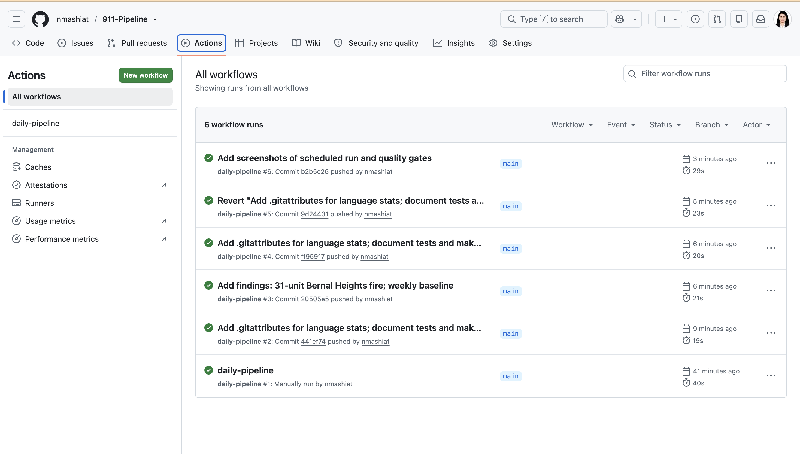
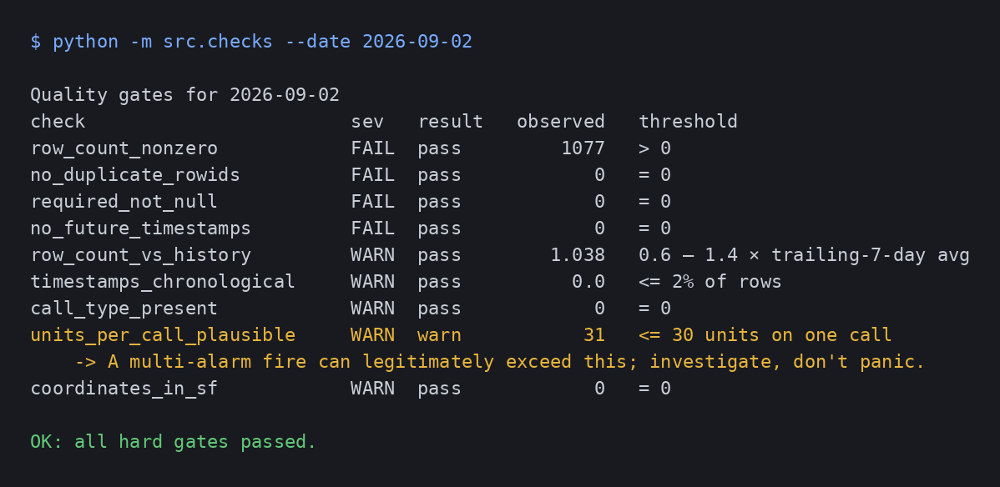

# 911-pipeline

A quality-gated data pipeline over San Francisco Fire/EMS 911 calls for service:
daily API extraction → typed staging with reject quarantine → quality gates that
halt the run → star schema → cross-layer reconciliation → daily aggregates.

Built to look like a production pipeline, not a notebook: every step is
idempotent, every rejection has a reason code, every gate result is stored,
and every metric is defined in writing.

```
SF Open Data API ──▶ data/raw/<date>.json      (untouched, one file per day)
                         │
                         ▼
                 staging_calls  +  staging_rejects(reason)      src/load.py
                         │
                         ▼
                 dq_results   ── FAIL? ──▶ stop                  src/checks.py
                         │
                         ▼
        dim_date · dim_call_type · dim_unit · dim_neighborhood
        fact_unit_response (unit grain) · fact_call (call grain)   src/transform.py
                         │
                         ▼
                 reconciliation (api↔raw↔staging↔fact)           src/reconcile.py
                         │
                         ▼
                 agg_daily  +  outputs/daily_summary.csv          src/aggregate.py
```

## Run

```bash
python3 -m venv .venv && source .venv/bin/activate
pip install -r requirements.txt

python run_pipeline.py --date 2026-09-01                   # one day, all steps
python run_pipeline.py --start 2026-09-01 --end 2026-09-07 # backfill
python run_pipeline.py --date 2026-09-01 --skip-extract    # reuse the raw file
```

Or with make: `make venv`, `make run DATE=2026-09-01`, `make backfill START=… END=…`, `make test`.

Exit code `1` means a hard quality gate or a reconciliation mismatch fired.
Each step also runs alone: `python -m src.extract --date …`, `src.load`, `src.checks`,
`src.transform`, `src.reconcile`, `src.aggregate`.

Look around afterwards:
```bash
sqlite3 sf911.db "SELECT * FROM dq_results WHERE load_date='2026-09-01';"
sqlite3 sf911.db "SELECT * FROM reconciliation ORDER BY load_date DESC LIMIT 9;"
sqlite3 sf911.db "SELECT neighborhood, ROUND(AVG(response_secs)) FROM fact_call fc
                  JOIN dim_neighborhood n USING(neighborhood_key) GROUP BY 1 ORDER BY 2;"
```

## Design decisions

**Raw is immutable.** The API response is written to disk as received. Every
downstream table can be rebuilt from it; nothing is ever fixed by hand.

**Schema is declared, not inferred.** The API drops null fields per row, so a
quiet day would otherwise produce a table missing `hospital_dttm`. `src/schema.py`
guarantees the same 35 columns every day.

**Reject, don't drop.** Rows that can't be loaded (missing key, unparseable
timestamp) go to `staging_rejects` with a reason code. Silent filtering is how
a count ends up wrong with nobody knowing why.

**Gates have severity.** A future timestamp or a duplicate key means the source
or the loader is broken → `FAIL`, stop. A few out-of-order timestamps are normal
in dispatch data → `WARN`, record, continue. Deciding which is which is the job.

**Two fact grains.** The source is one row per unit per call. Most questions are
about calls. `fact_unit_response` keeps the native grain; `fact_call` rolls up
with first-unit-on-scene as response time. Mixing grains is the most common
way a dashboard double-counts.

**Intervals are NULL, never negative.** A negative response time averages
silently into a report. NULL forces the question.

**Reconcile across every layer.** `api_vs_raw` catches extraction gaps and
source revisions; `raw_vs_staging` proves nothing was lost (rejects + dedupes
are counted); `staging_vs_fact` proves the transform didn't drop rows.

**Idempotent by day.** Each step deletes then reinserts its day. Rerunning a
day twice yields identical tables. Dimensions upsert and keep their keys.

## Tests

```bash
make test        # or: python -m pytest
```
`tests/` covers the loader (quarantine reasons, dedupe keeps latest, schema
completeness, idempotent rerun) and the gates (hard fail on future timestamps,
warn-not-fail on out-of-order timestamps, results recorded, exit code). Each
test runs against its own temporary database. The suite runs in CI on every push.

## Documentation

- [`docs/metrics.md`](docs/metrics.md) — what every number means
- [`docs/source_to_target.md`](docs/source_to_target.md) — field lineage
- [`sql/star_schema.sql`](sql/star_schema.sql) — the model

## Source

[Fire Department and EMS Dispatched Calls for Service](https://data.sf.gov/Public-Safety/Fire-Department-and-Emergency-Medical-Services-Dis/nuek-vuh3),
DataSF, PDDL license. One row per unit response; refreshed daily. Polled once
per day with an identifying User-Agent; no personal data is present or collected.

## Roadmap

- [x] GitHub Actions: run daily, commit `outputs/*.csv`
- [ ] PostgreSQL instead of SQLite
- [ ] Airflow DAG replacing `run_pipeline.py`
- [ ] Great Expectations suites replacing `src/checks.py`
- [ ] Docker Compose one-command run
- [ ] Power BI dashboard on `agg_daily`
- [ ] Second source (Houston live incidents) for cross-city reconciliation

## Scheduled runs

`.github/workflows/daily.yml` runs the pipeline every morning on GitHub Actions
for the trailing 8 days and commits three small files to `outputs/`:
`daily_summary.csv`, `dq_results.csv`, `reconciliation.csv`. The commit history
of that folder is the pipeline's run log. Commits are authored by `pipeline-bot`
so they are distinguishable from development work.

## Findings

**The gate that warned was right.** On 2 Sep 2026 the `units_per_call_plausible`
check (threshold: 30 units) fired for the first time. The call was a structure
fire in Bernal Heights received at 06:27, with 31 units dispatched — the largest
single response in the first week of data. Two more structure fires that day drew
12 and 11 units. First unit on scene in 370 seconds (6 min 10 s); 29 of the 31
dispatched units reached the scene (`fact_call`). The warning was correct to fire
and correct not to halt: a multi-alarm fire is real, not a data error. That's the
difference between `WARN` and `FAIL`.

**Typical day (1–7 Sep 2026):** ~1,050 unit responses across ~520 calls, about
two units per call. Zero rows rejected, zero cross-layer variance — the source
is clean and the API count matched the loaded row count on every day. Structure
fires and multi-unit medical calls account for nearly all calls above five units.

## In action




